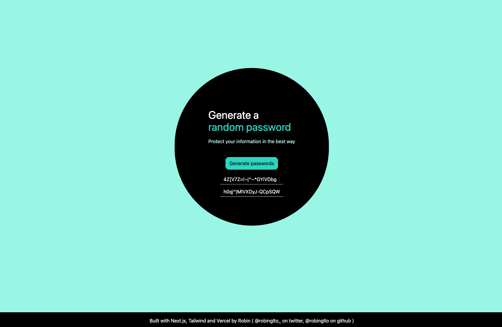

# Password Generator

A simple web application to generate random passwords.



## Features

- Generates random passwords with various characters.
- Easy-to-use user interface.
- Protect your information with strong passwords.

## Technologies Used

- HTML
- CSS (Tailwind CSS)
- JavaScript

## Usage

1. Clone the repository to your local machine:

   ```bash
   git clone https://github.com/robinxpfp/password-generator.git
   ```
